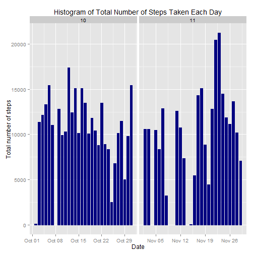
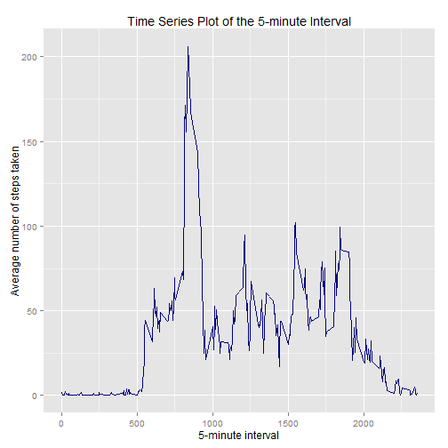
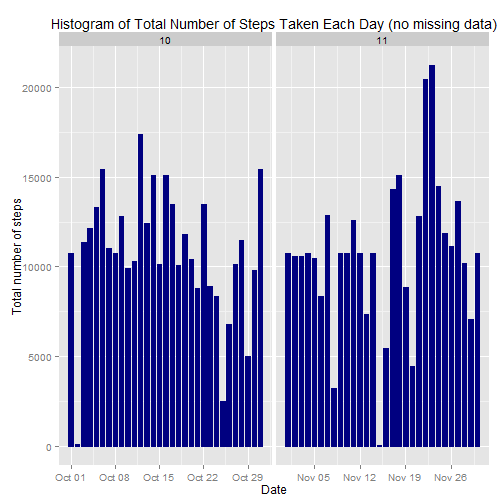
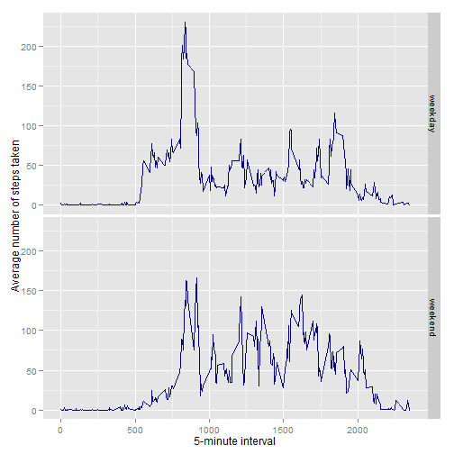

# Reproducible Research: Peer Assessment 1
  author: Yujing Cao
  date: December 11,2014

# Global Settings

```r
echo=TRUE
options(scipen=1)
```
# Load Data and Process Data

```r
activity=read.csv("C:/Users/y6u/Desktop/project1/repdata-data-activity/activity.csv",header=T,sep=","
                  ,colClasses=c("integer", "Date", "factor"))
activity$month <- as.numeric(format(activity$date, "%m"))
activity<- na.omit(activity)
rownames(activity) <- 1:nrow(activity)
head(activity)
```

```
##   steps       date interval month
## 1     0 2012-10-02        0    10
## 2     0 2012-10-02        5    10
## 3     0 2012-10-02       10    10
## 4     0 2012-10-02       15    10
## 5     0 2012-10-02       20    10
## 6     0 2012-10-02       25    10
```

```r
dim(activity)
```

```
## [1] 15264     4
```

# What is mean total number of steps taken per day?

```r
library(ggplot2)
```
For this part, we used the dataset without missing data
* Make a histogram of total number of steps taken every day

```r
ggplot(activity, aes(date, steps)) + geom_bar(stat = "identity", 
                                              colour = "navy",
                                              fill = "navy", 
                                              width = 0.7) + facet_grid(. ~ month, scales = "free") + labs(title = "Histogram of Total Number of Steps Taken Each Day", x = "Date", y = "Total number of steps")
```

 
* Calculate and report the mean and median total number of steps taken per day

```r
total_perday=tapply(activity$steps,activity$date,FUN=sum)
```
- mean of total number of steps taken every day

```r
oldmean=mean(total_perday)
```
The mean of total number of steps taken per day is 10766.
- median of total number of steps taken every day

```r
oldmedian=median(total_perday)
```
The median of totla number of steps taken per day is 10765.

# What is the average daily activity pattern?

```r
total_interval=aggregate(activity$steps,by=list(interval=as.numeric(as.character(activity$interval))),FUN=mean)
names(total_interval)[2]="mean_steps"
```
* Make a time series plot of the 5-minute interval (x-axis) and the average number of steps taken, averaged across all days (y-axis)

```r
ggplot(total_interval, aes(interval,mean_steps)) + geom_line(colour = "navy",width = 0.8)+labs(title ="Time Series Plot of the 5-minute Interval", x = "5-minute interval", y = "Average number of steps taken")
```

 
* Which 5-minute interval, on average across all the days in the dataset, contains the maximum number of steps?

```r
total_interval[total_interval$mean_steps==max(total_interval$mean_steps),]
```

```
##     interval mean_steps
## 104      835   206.1698
```
The 835th 5-minute interval contains the maximum number of steps 206.1698.

# Imputing Missing Data
## Import original data

```r
orig_data=read.csv("C:/Users/y6u/Desktop/project1/repdata-data-activity/activity.csv",header=T,sep=","
                   ,colClasses=c("integer", "Date", "factor"))
orig_data$month=as.numeric(format(orig_data$date, "%m"))
```
* The total number of missing values in the dataset

```r
sum(is.na(orig_data))
```

```
## [1] 2304
```
## Fill in all the missing data
I choose mean of 5-minute interval to imput missing data and make a new dataset

```r
newdata=orig_data
for(i in 1:dim(newdata)[1]){
  if(is.na(newdata$steps[i])){
    newdata$steps[i]=total_interval[which(newdata$interval[i]==total_interval$interval),]$mean_steps
    
  }
}

head(newdata)
```

```
##       steps       date interval month
## 1 1.7169811 2012-10-01        0    10
## 2 0.3396226 2012-10-01        5    10
## 3 0.1320755 2012-10-01       10    10
## 4 0.1509434 2012-10-01       15    10
## 5 0.0754717 2012-10-01       20    10
## 6 2.0943396 2012-10-01       25    10
```

```r
sum(is.na(newdata))
```

```
## [1] 0
```
## Make a histogram of the total number of steps taken each day based on newdata

```r
ggplot(newdata, aes(date, steps)) + geom_bar(stat = "identity",
                                             colour = "navy",
                                             fill = "navy",
                                             width = 0.7) + facet_grid(. ~ month, scales = "free") + labs(title = "Histogram of Total Number of Steps Taken Each Day (no missing data)",
                                                                                                x = "Date", y = "Total number of steps")
```

 
## Calculate and report the mean and median total number of steps taken per day

```r
total_new=tapply(newdata$steps,newdata$date,FUN=sum)
```
- mean of total number of steps taken every day

```r
newmean=mean(total_new)
```
- median of total number of steps taken every day

```r
newmedian=median(total_new)
```

* compare old mean with new mean, and compare old median with new median

```r
oldmean-newmean
```

```
## [1] 0
```

```r
oldmedian-newmedian
```

```
## [1] -1.188679
```
After imputing missing data, the newmean equals to oldmean, however, newmedian is a little greater than oldmedian

# Are there differences in activity patterns between weekdays and weekends?
* Create a new factor variable in the dataset with two levels -- "weekday" and "weekend" indicating whether a given date is a weekday or weekend day.

```r
newdata$weekdays=factor(format(newdata$date,"%A"))
levels(newdata$weekdays)
```

```
## [1] "Friday"    "Monday"    "Saturday"  "Sunday"    "Thursday"  "Tuesday"  
## [7] "Wednesday"
```

```r
levels(newdata$weekdays)=list(weekday=c("Monday","Tuesday","Wednesday","Thursday","Friday")
                              ,weekend=c("Saturday","Sunday"))
levels(newdata$weekdays)
```

```
## [1] "weekday" "weekend"
```

```r
table(newdata$weekdays)
```

```
## 
## weekday weekend 
##   12960    4608
```
* Make a panel plot containing a time series plot (i.e. type = "l") of the 5-minute interval (x-axis) and the average number of steps taken, averaged across all weekday days or weekend days (y-axis).

```r
interval_weekdays=aggregate(newdata$steps,by=list(interval=as.numeric(as.character(newdata$interval)),
                                                  weekdays=newdata$weekdays),FUN=mean)
names(interval_weekdays)[3]="meansteps"
ggplot(interval_weekdays, aes(interval,meansteps)) + geom_line(colour = "navy",width = 0.8)+facet_grid(weekdays~ .)+xlab("5-minute interval")+ylab("Average number of steps taken")
```

 

From the graph, we could find there are some difference patterns between weekdays and weekends.
